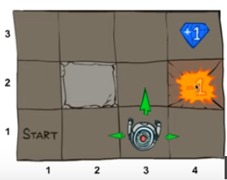
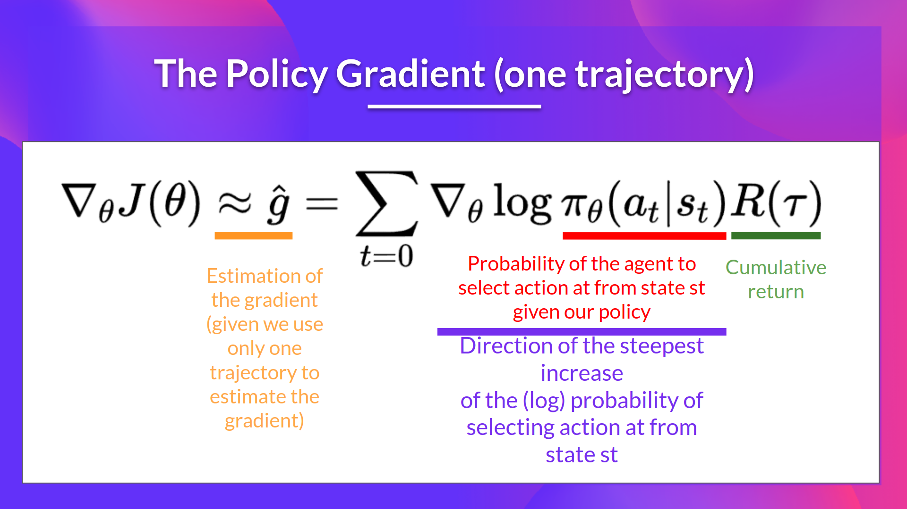

# Series
## [Foundations of Deep RL](https://www.youtube.com/playlist?list=PLwRJQ4m4UJjNymuBM9RdmB3Z9N5-0IlY0)
### L1, Markov Decision Process (MDP), Exact Solution Methods, Max-ent RL
* map to an MDP means something can be trained with RL
* MDP
    * states S
    * actions A
    * transition function $P(s'|s, a)$, probability of the next state $s'$, given the current state and action
    * reward function $R(s, a, s')$, reward of that above transition
    * start state $s_0$
    * discount factor $\gamma$, things in the future we care less about, discount future rewards
    * Horizon $H$, duration
* The goal of MDP is: find a policy that maximizes reward overtime
    $$
    max_\pi E [\sum^H_{t=0}\gamma^tR(S_t, A_t, S_{t+1})|\pi]
    $$
    here, $\pi$ is the policy. It reads: maximum the expected total reward $R$, following the policy $\pi$, discounted over time $\gamma^t$, over a finite horizon $H$
* some examples: server management, cleaning robot, walking robot, pole balancing, games, shortest path, models for animals
* Map your problem onto the MDP is the key
#### Gridworld
* Gridworld example: an agent explore a 2d grid map with obstacles and rewards, the goal is to collect the reward in the map
* find a policy of how to navigate the map
* the discount factor makes the future rewards less attractive, incentivize the agent to find the shortest path
* Here is an example:  
based on MDP
    $$
    V^*(s)=max_\pi E [\sum^H_{t=0}\gamma^tR(S_t, A_t, S_{t+1})|\pi, s_0 = s]
    $$
    We have the following state:

| Vars                                          | $V^*(4,3)$ | $V^*(3,3)$                                            | $V^*(2,3)$ | $V^*(1,1)$ | $V^*(4,2)$ |
| --------------------------------------------- | ---------- | ----------------------------------------------------- | ---------- | ---------- | ---------- |
| gamma = 1, H = 100                            | 1          | 1                                                     | 1          | 1          | -1         |
| gamma = 0.9, H = 100                          | 1          | 0.9                                                   | 0.9^2      | 0.9^5      | -1         |
| gamma = 0.9, H = 100, action success rate 0.8 | 1          | 0.9 * 0.8 + 0.9 * 0.1 * V*(3,3) + 0.9 * 0.1 * V*(3,2) |            |            |            |
* when the action success rate is less than 1, the rewards depend on rewards of other squares. This is called value iteration
* value iteration
    * when H=0, there is no time left to move, so reward V* is 0
    * when H=1 the reward
    $$
    V_1^*(s) = max_a\sum_{s'}P(s'|s,a)(R(s, a, s')+\gamma V_0^*(s'))
    $$
    which means the reward is the sum of probability of taking an action times the sum of the reward of the action and the discounted value of the reward of next action over all possible actions. Then we find the action that gives us the most reward.
    * when H=k, we have
    $$
    V_k^*(s) = max_a\sum_{s'}P(s'|s,a)(R(s, a, s')+\gamma V_{k-1}^*(s'))
    $$
    * algorithm
    ```
    start with reward at time 0 for all S
    for k = 1, ..., H:
        for all state s in S
        derive the maximum reward V_k^*(s)
        find the policy that gives the maximum reward: argmax
    ```
    this is called Bellman update/back-up
    * convergence behavior: after n steps, the rewards no longer change, which means the horizon can be infinite while the optimal rewards are the same
    * intuition: once we arrive at convergence at step H, the additional reward collected over steps H+1, H+2, ... converges to 0:
    $$
    \gamma^{H+1}R(s_{H+1})+\gamma^{H+2}R(s_{H+2})+..\leq \gamma^{H+1}R(max) + \gamma^{H+2}R(max)+...=\frac{\gamma^{H+1}}{1-\gamma}R_{\max}
    $$
    * exercise: given a gridworld, different combinations of discount and noise will result in different actions
#### Q-values
* Q*(s,a) expected utility of starting in state s and action a and (therefore) acting optimally
    $$
    Q^*(s, a) = \sum_{s'}P(s'|s,a)(R(s, a, s')+\gamma \max_{a'}Q^*(s', a'))
    $$
    This is very similar to V*, but the last term starting with $\gamma$ change to Q*. The definition reads: Q* is the expected rewards of taking action a to arrive at state s', plus the best possible rewards for future actions
* this is a recursive definition
* (comment) unlike V*, which only depends on state, Q* also depends on action
* Q-value iteration
* now the Q-values are different depending on the next step, so for each state, we have 4 values in the gridworld (4 directions to move next); therefore we can compare the Q values and choose the action that gives the highest value
#### policy iteration
* policy evaluation: fix policy instead of taking the max of all actions:
$$
V_k^{\pi}(s) = \sum_{s'}P(s'|s,\pi(s))(R(s, \pi(s), s')+\gamma V_{k-1}^{\pi}(s'))
$$
* algorithm for policy iteration
    * find the best action according to one-step look-ahead
* theorem: policy iteration is guaranteed to converge and at convergence, the current policy and its value function are optimal policy and the optimal value function
#### Maximum Entropy formulation
* another way of solving MDP
* what if we could find a distribution over near-optimal solutions?
* in large scale problem, the best policy is not clear, we need to collect data along the way
    * this approach allows us to collect more interesting data
* *entropy*
    * entropy is the measure of uncertainty over random variable x
    * in information theory, it defines the number of bits required to encode x (on average)
    * use short bit sequence to values that are likely and more for unlikely
    * calculate the entropy
* formulation: instead of $\max_{\pi}E[\sum^H_{t=0}r_t]$ we have
$$
\max_{\pi}E[\sum^H_{t=0}r_t + \beta H(\pi(\cdot|s_t))]
$$
    the extra term is the maximum entropy of the policy over each state
* the entropy term introduces a trade off: if we have big $\beta$, we will collect less entropy. Instead we collect better learning data.
* how to solve MDP with maximum entropy formulation
* constrained optimization
* to solve MDP with maximum entropy formulation, we turn that into a constrained optimization problem and solve the lagrangian for that problem instead
    * one-step solution:
    $$
    \pi(a) = \frac{1}{Z}exp(\frac{1}{\beta}r(a))
    $$
    where
    $$
    Z = \sum_aexp(\frac{1}{\beta}r(a))
    $$
    * the resulting policy gives higher probability to high rewards and low probability to low rewards
    * at the same time, the bigger the $\beta$, the less important is the reward
### L2, Deep Q Learning
* iteration based solution to finding the optimal policy has 2 limitations:
    * requires access to dynamics model (transition model, given the current state and action, get the probability of the next state)
    * requires iteration over all states and actions
* for problem 1 above, we need sampling-based approximations where an agent collects its own experience
* for p 2, Q/V function fitting (use neural network to calculate the next state)
#### Q-learning
* Q-values and bellman equation to find the Q-value
* rewrite Q-value iteration to remove the need for a transition function; replace expectation by samples
* Tabular Q-learning: 
  $$ Q_{k+1} \leftarrow \mathbb{E}_{s'\sim P(s'|s,a)} [R(s,a,s')+ \gamma \max_{a'}Q_k(s', a')]$$
    * instead of transition function, we get expected next state from the distribution
    * algorithm: 
        * if next state isn't terminal, we set the $target = R(s, a, s') + \gamma \max_aQ_k(s',a')$
        * use the above target to update Q value
* how to sample actions?
    * choose action that maximizes $Q_k(s,a)$, but this leaves no room for exploration
    * better: $\epsilon$-Greedy: choose random action with prob. $\epsilon$, otherwise choose action greedily
* Q-learning properties:
    * converges to optimal policy even if you are acting suboptimally! (*off-policy learning*)
    * caveats:
        * need to explore enough for above to be true
        * learning rates should be small enough
        * not decrease it too quickly
    * requirements:
        * all states and actions are visited infinitely often: in the limit, it doesn't matter how you select actions
        * learning rate sums to infinity, but its square is bounded, less than infinity
* crawler example
* tabular methods can't scale
    * crawler uses crude discretization, has 100 states
    * tetris has 10^60 state
* approximating Q-learning: use a parametrized Q function, $Q_\theta(s,a)$ (instead of a table)
    * it can be a linear function of features and feature weights
    * neural net, decision tree, etc
#### Neural net
* deel learning improved CV results dramatically
* Multi-layer perceptron:
    * linear function $f(x) = Wx$
    * MLP stack linear function and non-linearity (activation function)
    * 2-layer: $f(x) = W_2 \max(0, W_0x)$, here the max function introduces nonlinearity (relu)
* optimization for NN is non-convex
    * but gradient-based methods are surprisingly effective
    * gradient calculation done by auto differentiation
    * most common: SGD + momentum + preconditioning (RMSProp, Adam, Adamx)
* Q: unclear how is parametrized Q and tabular differ in terms of math expressions
#### Deep Q networks (DQNs)
* use dl in Q-learning
* used by deepmind
* new instead of Q_k, we have $Q_\theta(s,a)$, 
* in training, we need to update $\theta$, the parameters of the NN
* DQN algorithm
* Q: don't understand learning target and DQN algorithm
### L3, Policy Gradient
* policy gradient derivation
* temporal decomposition to make it more data efficient
* baseline subtraction and value function estimation reduce variation
* stochasticity allow policies to be smoother, easy to optimize
* why policy optimization: policy can be simpler than Q or V
    * value function doesn't prescribe action, would need dynamics model
    * q value function need to solve argmax, which is challenging for continuous/high dim action space
* likelihood ratio policy gradient
* we want to optimize the overall utility $U$ of using a policy $\pi$ over a state-action sequence, a trajectory, $\tau$, where $\tau = s_0, u_0,...,s_{H}, u_{H}$.We can express the utility as: 
    $$U(\theta) = E[\sum^H_{t=0}R(s_t, u_t); \pi_{\theta}]$$ 
    Given an expectation under a distribution, we can turn it into a sum over all possible events weighted by their probabilities (which is the definition of expectation). In our case, we can rewrite this expectation in terms of a probability function, $P$, of a trajectory, $\tau$, under policy $\pi_{\theta}$ and the corresponding reward, $R$: 
    $$U(\theta) = E[\sum^H_{t=0}R(s_t, u_t); \pi_{\theta}] = \sum^H_{t=0}P(\tau; \theta)R(\tau)$$
    The goal is to find the parameter $\theta$, and ultimately, its associated policy, that gives the maximum utility: 
    $$\max_{\theta} U(\theta) = \max_{\theta} \sum_{\tau}P(\tau; \theta)R(\tau)$$ 
    Next, we will use gradient optimization to solve this problem. We take the gradient of $u$ with respect to $\theta$: 
    $$\nabla_\theta U(\theta) = \nabla_\theta \sum_{\tau} P(\tau;\theta) R(\tau)$$
    Based on the linearity of gradient, the gradient of sum is the sum of gradient. Therefore, we have: 
    $$\nabla_\theta \sum_{\tau} P(\tau;\theta) R(\tau) = \sum_{\tau} \nabla_\theta P(\tau;\theta) R(\tau)$$ 
    Here, we want to have a weighted sum of $P$ so that we can sample the trajectories in the future. To get there, we multiply and divide by $P(\tau; \theta)$: 
    $$ \sum_{\tau} \frac{P(\tau;\theta)}{P(\tau;\theta)} \nabla_\theta P(\tau;\theta) R(\tau)$$ 
    Notice now we have a derivative of a $log$ function: 
    $$\nabla_\theta \log f(x) = \frac{1}{f(x)} \nabla_\theta f(x)$$
    Our gradient becomes 
    $$ \sum_{\tau} \frac{P(\tau;\theta)}{P(\tau;\theta)} \nabla_\theta P(\tau;\theta) R(\tau) = \sum_{\tau} P(\tau;\theta) \nabla_\theta \text{log}P(\tau;\theta) R(\tau)$$
    Here, we can apply the definition of expectation again, now in reverse: 
    $$ \sum_{\tau} P(\tau;\theta) \nabla_\theta \text{log}P(\tau;\theta) R(\tau) = E[\sum \nabla_\theta \text{log}P(\tau;\theta) R(\tau)]$$ 
    which gives us the expected value of a function, $\nabla_\theta \text{log}P(\tau;\theta) R(\tau)$, under distribution $P(\tau; \theta)$. This allow us to use a sample-based estimate of $P(\tau; \theta)$ instead of enumerating all possible trajectories. Using an empirical estimate of the expectation with $m$ samples, we get 
    $$\nabla_\theta U(\theta) \approx \hat{g} = \frac{1}{m} \sum_{i=1}^m \nabla_\theta \log P(\tau^{(i)};\theta) R(\tau^{(i)})$$
* in the above function, no gradient is taken for the reward function, which means the reward function can be discontinuous or unknown
* this gradient increase probability of paths with high reward and vice vera
* instead of the entire paths, we also want to consider more localized path by decompose path into state and actions: 
    $$P(\tau; \theta) = \prod^H_{t=0}P(s_{t+1}|s_t, u_t)\cdot\pi_{\theta}(u_t|s_t)$$
    it turns out the original gradient of the trajectory now becomes 
    $$\nabla_\theta \log P(\tau^{(i)};\theta) = \sum_{i=1}^m \nabla_\theta \log \pi_\theta(u_t|s_t)$$
    which means the dynamic model, $P$, is no longer needed. What this say is increase the probability of the trajectory will increase the probability of the actions in the trajectory, vice versa
* so the original likelihood ratio policy gradient
    $$\hat{g} = \frac{1}{m} \sum_{i=1}^m \nabla_\theta \log P(\tau^{(i)};\theta) R(\tau^{(i)})$$
    where
    $$\nabla_\theta \log P(\tau^{(i)};\theta) = \sum_{i=1}^m \nabla_\theta \log \pi_\theta(u_t|s_t)$$
   This is where backpropagation comes in: feed the state $s_t$ into the network, compute the probability of action $u_t$, then backprop through the network to compute the gradient of $\log \pi_\theta(u_t|s_t)$ wrt all $\theta$
* the above formula is noisy, we need to introduce more temporal structure (next lecture, trust region / natural gradient)
* baseline subtraction, $R$ becomes $R - b$, but this still leave the likelihood unbiased!
* the baseline makes sure that new action is better than the expected return under the current policy
* advantage estimation: advantage is $R - b$
* when choosing a baseline b, there are many options: constant, time-dependent, state-dependent (value function)
* a baseline based on value function $V(s_t) = \mathbb{E}[r_t + r_{t+1} + ...]$
* monte carlo estimation of $V^\pi$
* bootstrap estimation of $V$
* currently, $R$ is estimated by sample estimate $R$, we can improve this by introduce a discount factor $\gamma$ and function estimation
* trade off between variance and bias
## [HF Deep RL Course](https://huggingface.co/learn/deep-rl-course/en/unit1/rl-framework)
### Unit 1
* RL process is called a Markov Decision Process (MDP)
* the Markov Property implies that our agent needs only the current state to decide what action to take and not the history of all the states and actions they took before.
* state is a complete description of the world (fully observed environment)
* observation is a partial description of the state (eg. game map is not fully disclosed to the player)
* discount: present rewards weighs more than distant rewards
* types of tasks: episodic and continuing
    * episodic task has a terminal state
    * continuing task has no terminal state
* exploration and exploitation trade off
    * exploitation: exploiting known information to maximize the reward
    * exploration: exploring the environment by trying random actions in order to find more information about the environment
* policy: defines which action to take given the state; the goal of RL is to find the optimal policy, $\pi^*$, that maximizes expected reward
* two approaches to training agents:
    * policy-based: train a policy function "what action do I take for the given state", can be deterministic or not
    * value-based: train a value function that answers "what value do i get for the given state"
* deep Reinforcement Learning introduces deep neural networks to solve Reinforcement Learning problems
### Unit 2
* for value-based approach, since the policy is not trained, we specify its behavior to take the greedy approach, it will choose actions with the biggest reward: $arg \max_a Q_{\pi} (s,a)$; another option is epsilon-greedy method
* finding an optimal value function leads to having an optimal policy: $$\pi^{*}(s) = arg \max_a Q^{*} (s,a)$$ where $Q^{*}$ and $\pi^{*}$ are optimal value and policy, respectively. Once we have a value function, we know which action to take at each state
* two types of value-based methods: state-value (V) and action-value function (Q)
    * state-value function: given the state $s$, if agent follows policy $\pi$, the expected outcome is $V_\pi(s)$
    * action-value function: for each state, action pair, the expected return is $Q_\pi(s, a)$ if it follows policy $\pi$
* problem with the above approach is that we need to sum all state or state-action pair for each $V$ or $Q$, which is computationally expensive
* Bellman Equation
    * $$V_\pi(s) = \mathbb{E}_\pi[R_{t+1} + \gamma \times V_\pi(S_{t+1}) | S_t = s]$$
    which is basically: `Rt+1 + gamma * V(St+1)`, immediate reward + the discounted value of the state that follows
    * use recursion to save computation
    * this is dynamic programming: a recursive function that is the sum of the current state and recursion of the next state
* Monte Carlo vs Temporal Difference:
    * monte carlo ues an entire episode of experience
    * temporal difference uses one step
* Monte Carlo
    * require the return of the entire episode before update: 
    $$V(S_t) \leftarrow V(S_t) + \alpha [G_t - V(S_t)]$$
* Temporal Difference (TD)
    * only waits for one step before update
    * since we don't know the total reward, we estimate it with reward and discounted value of the next state $R_{t + 1} + \gamma V(S_{t+1}) $ to formula
    $$V(S_t) \leftarrow V(S_t) + \alpha [R_{t + 1} + \gamma V(S_{t+1}) - V(S_t)]$$
* Q-Learning
    * Q-learning is an off-policy value-based method that uses a TD approach to train its action-value function
    * an algorithm to train Q-function
    * Q stands for value of action-state
        * which differs from reward, which is the feedback from the env
        * *value* is the expected cumulative reward our agent gets if it starts at this state and act accordingly to a policy
        * Q value is stored in Q-table, which all values are 0 when initialized; Q-function search for corresponding value in the table
        * When the training is done, we have an optimal Q-function, which means we have optimal Q-table. We will also have an optimal policy, since we know the best action to take at each state.
    * algorithm (sarsamax, Q-learning):
    ```
    step 1: initialize Q-table to all 0
    step 2: choose action with epsilon-greedy strategy
    step 3: perform action A_t, and observe R_{t+1}, S_{t+1}
    step 4: update Q(S_t, A_t)
    ```
    * spelled out  
    * *epsilon-greedy policy*
        * with probability $1 - \epsilon$, exploitation, otherwise exploration
        * $\epsilon$ starts with 1 at the beginning of the training, which means we only do exploration, then the $\epsilon$ value gets smaller, we will switch to exploitation
    * To derive discounted value of the next state $\gamma V(S_{t+1})$, we *bootstrap* by finding the action that max the Q value at next state $\gamma max_aQ(S_{t+1}, a)$
        * note that we use a greedy method to choose action, not greedy epsilon
        * *off-policy*: a different policy for acting (inference) and updating 
        * use greedy to update, use epsilon-greedy to act
        * *On-policy*: using the same policy for acting and updating.
        * update function   
### Unit 3
* Q-learning is a tabular method, it is not scalable
* we approximate the Q-value with parametrized Q-function $Q_\theta(s,a)$
* Deep Q-learning:
    * As input, we take a stack of 4 frames passed through the network as a state and output a vector of Q-values for each possible action at that state
    * stacked frame can capture the motion
    * the frames go thru convolutional layers, then fully-connected layers before produce Q values
    * in Deep Q-Learning, instead of updating Q values, we create a loss function that compares our Q-value prediction and the Q-target and uses gradient descent to update the weights of our Deep Q-Network to approximate our Q-values better
    * algorithm:
        * Sampling: we perform actions and store the observed experience tuples in a replay memory.
        * Training: Select a small batch of tuples randomly and learn from this batch using a gradient descent update step
* stabilize deep Q-learning:
    * experience replay thru a relay buffer: save experience that will be reused; prevents the network from only learning from the immediate before
    * fixed Q-target: for bellman equation, both Q-value and TD-target changes, this is a moving target problem; instead, we fix param $\theta^-$, only update every C steps
    * double deep Q-learning
### Unit 4 Policy Gradient
* We want to optimize policy directly, not value function
* underlying hypothesis of RL: all goals can be described as the maximization of the expected cumulative reward
* in policy-based methods, we parameterize the policy
    * can be a neural network: $\pi_\theta(s) = \mathbb{P}[A|s;\theta]$
    * the objective is to maximize the performance of the policy with adidas men ascent (notice, not descent since we are doing maximization)
    * we define an objective function $J(\theta)$. It is the expected cumulative reward. The goal is to find value $\theta$ that maximizes this objective function
* policy-gradient methods are a subclass of policy-based methods
    * in policy-based, we optimized $\theta$ indirectly by maximize the local approximation of the objective function (on-policy)
    * in policy-gradient, we optimized $\theta$ directly by performing the gradient ascent on the performance of the objective function $J(\theta)$
* advantage of policy-gradient method
    * unlike value-based method, no need to store action-values
    * policy-gradient can learn a stochastic policy while value function cannot
        * deterministic policy can have trouble with perceptual aliasing; an optimal stochastic policy will not have this problem (robot stuck in two similar-looking bricks)
    * policy-gradient are more effective in high-dimensional action space and continuous action space (for example, deep q learning assign a score for each action, which is impossible if action options are infinite)
    * policy gradient have better convergence because stochastic policy change smoothly over time; in value-based training, the max operation change action drastically
* disadvantages of policy-gradient
    * converge to local maximum instead of a global max
    * slower, take longer to train
    * can have high variance
* for policy gradient, we need a parameterized stochastic policy $\pi_\theta(s_t)$, where the input is a state and the output is the probability distribution over actions at that state, the goal is to tune the policy s.t. good actions are sampled more often
* the idea is to let the agent interact during an episode, if the agent wins, we will sample it more in the future; we increase $P(a|s)$. The big-picture algorithm looks like:
```
Training loop:
    collect an episode with the policy \pi
    calculate the return (sum of rewards)

    update the weights of \pi
        if positive return: increase the prob. of each state, action pairs taken during the episode
        if negative return: decrease 
```
* Stochastic policy: $\pi_\theta(s) = \mathbb{P}[A|s;\theta]$, this says the policy $\pi$, given a state $s$, outputs a probability distribution of actions
* How do we know if the policy is good? **The objective function** $J$ gives the expected cumulative reward (performance) of an agent over a trajectory (state action sequence, $\tau$): $J(\theta) = E_{\tau \sim \pi }[R(\tau)]$, where $R$ term is the cumulative reward over a trajectory $\tau$
    * $R(\tau) = r_{t+1} + \gamma r_{t+2} + ... $
* Policy-gradient is an optimization problem: we want to find the values of $\theta$ that maximize our objective function $J(\theta)$, so we need to use gradient ascent. It’s the inverse of gradient-descent since it gives the direction of the steepest increase of $J$
* However, $J$ is not easily differentiable, so we use Policy Gradient Theorem that to help us reformulate the objective function into a differentiable function; it turns out we can turn the gradient of $J$ into: $$\nabla_\theta J(\theta) = \mathbb{E}_{\tau \sim \pi_\theta}\left[\sum_{t=0} \nabla_\theta \log \pi_\theta(a_t|s_t) R(\tau)\right]$$ We can interprete this as the gradient of the (log) probability of action ($\text{log}\pi$) times cumulative return ($R$, the scoring function) 
* **Reinforce** a policy-gradient algorithm that uses an estimated return from an entire episode to update the policy parameter, it builds on top of policy gradient theorem $$\nabla_\theta J(\theta) \approx \hat{g} = \sum_{t=0} \nabla_\theta \log \pi_\theta(a_t|s_t) R(\tau)$$  

### Unit 6 Actor Critic 
* policy gradient suffers from high variance, because small difference in action choices can lead to big differences in rewards
* Q: variance and bias tradeoff
* we introduces two model an actor model that acts according to a policy, and a critic model that judges how good an action (a value function)
    * at each step, the actor acts, the critic produces a Q-value
    * the actor updates policy parameters using the Q-value
    * the actor takes another action and arrives at a new state, which allows us to calculate weight updates of value functions based on the differences
### Unit 8 Proximal Policy Optimization (PPO)
* The goal of PPO is to update policy conservatively. We use a clip ratio for policy update
* we use a new objective function called clipped surrogate objective function that constrains the policy change thru a clip
* With the Clipped Surrogate Objective function, we have two probability ratios, one non-clipped and one clipped in a range between $[1 - \epsilon, 1+\epsilon]$, epsilon is a hyperparameter that helps us to define this clip range (in the paper ϵ=0.2ϵ=0.2.)
$$L^{\text{CLIP}}(\theta) = \mathbb{E}_t \Bigg[\min \Big(r_t(\theta) \, \hat{A}_t, \; \text{clip}\big(r_t(\theta), 1 - \epsilon, 1 + \epsilon\big) \, \hat{A}_t\Big)\Bigg]$$ 
* the unclipped part, $r_t(\theta) \, \hat{A}_t$, is used to replace the $\text{log}\pi$ term in policy gradient theorem. It is a ratio multiplied by advantage (see actor critic), it produces a change based on ratio of the old and new parameters
# Articles
## [A Reinforcement Learning Guide](https://naklecha.notion.site/a-reinforcement-learning-guide)
* Terms: state, reward, action
* `V(s) = max(γ * V(s') )` states that the **value** of the current position is dependent on the value of the next position
    * `γ` is call discount factor: it is a way to penalize states that are further away from the optimal state
    * the problem with this formulation is the value of states depend on the winning state, which doesn't happen until the end, which means you have to work backwords
    * need to introduce a **reward** for intermediary steps
* Bellman Equation: `V(s) = max( R(s, a) + γ * V(s') )`
    * `R(s, a) + γ * V(s')` is represented as `Q(s, a)`, **action-value function**
    * `R(s,a)` is a reward function for current action and state
    * notice that value still depends on the optimal state
    * the goal here is to estimate rather than solve the problem
* exploration vs. exploitation: try new actions versus use existing (not necessarily the optimal) winning strategy
* real-time dynamic programming (RTDP) is an epsilon-greedy algorithm
    * With probability ε: Choose a random action; with probability (1-ε): Choose the action that maximizes the expected value
    * Initially explore broadly (because of the high starting exploration rate) to avoid local optima; Eventually, exploit known good paths. As the exploration rate decays towards 0, we essentially take action greedily. We do this because over time our confidence in value estimates increases.
    * algorithm:
    ```
    def rtdp(state_space, actions, initial_state):
    V = {s: 0 for s in state_space}
    epsilon = epsilon_start
    
    gamma=0.99 # discount factor from bellman equation
    epsilon=0.9 # exploration rate, ε as described above
    max_episodes=1000 # number of iterations
    epsilon_decay = 0.995 # epsilon decay amount after each episode

    for episode in range(max_episodes):
        state = initial_state
        while not terminal(state):
            # next action decided using epsilon-greedy method
            best_action = argmax(actions, lambda a: V[get_next_state(state, a)])
            next_action = random_action() if random() < epsilon else best_action
            next_state = transition(state, next_action)
            # Bellman update 
            max_future_value = max(V[get_next_state(state, a)] for a in actions)
            V[state] = reward(state,next_action) + gamma * max_future_value
            state = next_state
        epsilon *= epsilon_decay
    return V
    ```
    * Problems with RTDP: 
        * initial values: depends on initial value function estimate
        * coverage: may ignore relevant states
        * exploration decay: hard to set an optimal decay rate
* Monte Carlo Tree Search (MCTS)
    * selection stage: select a path based on a formula called the Upper Confidence Bound (UCB) scores
        * UCB: `Q(s,a) + c * √(ln(N) / n)` this balances exploitation (`Q(s,a)`) and exploration (`c * √(ln(N) / n)`) where `N` is the totoal number of visits to the parent node and `n` is the # of visits to the child node. If we have a unvisited child node, this term is infinity.
        * The more we visit a node, the smaller the exploration bonus becomes (because the denominator n increases), naturally shifting our focus to the most promising moves.
    * expansion state: select an action that hasn’t been performed and returns a new node (the new state) after performing that action
        * add one child node per expansion for memory efficiency
    * playout (simulation) stage: 
        * this is simulation, rather than actually making the move (q: what's the difference?)
        * intuition: instead of carefully analyzing every possible move, you just play random moves until the game ends
        * over many iterations, these random playouts actually give us meaningful information about which moves are generally better
        * AlphaGo:  instead of random playouts, it used its value network to directly evaluate board positions. This value network was trained on millions of positions and could estimate the winning probability without needing to play out random moves
    * backpropagation stage: update all nodes visited (visit count, value (Q))
    * MCTS build values states from scratch each time, unlike RTDP, where initial values matters a lot
* In real world, the problem is to recommend things based on limited interactions, like Netflix watch list; you can't ask the user to try out every movie before you get a winning strategy
* On-policy and off-policy learning:
    * on-policy algorithm learn from their own experience (like RTDP)
    * off-policy can learn from datasets like Netflix viewing history, or external feedback (human feedback, tool use)
* To build a Netflix recommendation system based on user preference:
    * `Q(user, movie)` represents how much the user likes a movie?
    * in real world, we break down user and movie into features that are more general: `Q(user_features, movie_features)`
    * an example goes like this:
        * initialize `Q(user_features, movie_features) = 0`
        * to understand 26 yo preference for sci-fi movies, we look at 1 user's rating of Interstellar: `Q(age=26, sci_fi) = Q(age=26, sci_fi) + α * (avg_rating_of_Interstellar - user_a_rating_of_Interstellar)` where `α` is learning rate
        * do this for all combination of `user_features` and `movie_features` for every row (user's rating of a movie) in the dataset
        * this is captured by `Q(s,a) = Q(s,a) + α * (user_rating - Q(s,a))`
    * The same Q matrix method can be applied to the game of chess, with `user_rating` swapped by `game_outcome`. However, the problem is that game outcome is a simplistic metric. A good move for the losing side will be rated a low score because he lost the game.
* Q-learning: `Q(s,a) = Q(s,a) + α * [ R + γ * max(Q(s',a')) - Q(s,a) ]` where `R + γ * max(Q(s',a'))` is called target value, which is a better representation of the outcome
* Currently, `Q(s,a)` is a table; we can train a neural network to predict q values (Deep Q-learning)
    * This NN:
        * input: raw board position; output: Q-values for all possible moves; hidden layers: hopefully auto discover patterns
        * `Q(s,a;θ)` is the NN, our Q-learning function becomes: `Q(s,a;θ) ≈ R(s,a) + γ * max(Q(s',a';θ))`
        * To train
            * our target is `y = R + γ * max(Q(s',a';θ))`
            * current prediction is `Q(s,a;θ)`
            * loss: `L = (y - Q(s,a;θ))²`
            * weight updates with gradient descent: `θ_new = θ_old - α * ∂L/∂θ`

## [RL for LLM reasoning](https://sebastianraschka.com/blog/2025/the-state-of-reinforcement-learning-for-llm-reasoning.html)      

